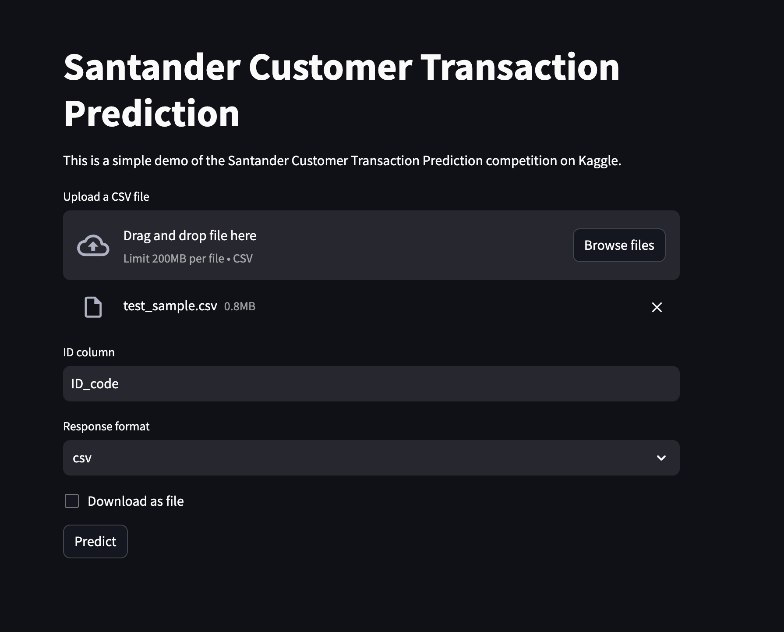
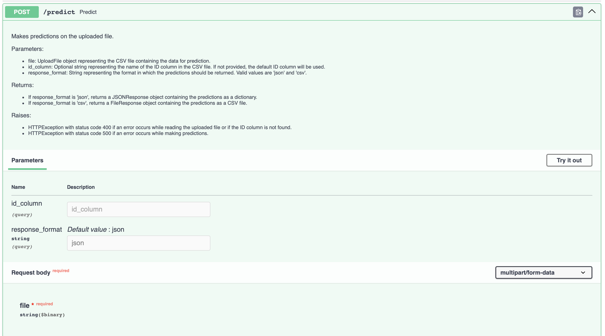

# Santander Customer Transaction Prediction

This project is designed as an example for streamlining and automating machine learning projects. This project integrates modern MLOps practices, including continuous integration (CI), continuous deployment (CD), and automated machine learning model evaluation, training, and deployment.

View the live application [here](https://santander-frontend-jlgkdezfva-em.a.run.app/)!

## Project Structure

The project is structured as follows:

```sh
santander-mlops/
├── backend/
│   ├── tests/
│   │   ├── __init__.py
│   │   └── test_api.py
│   ├── __init__.py
│   ├── api.py
│   ├── config.py
│   └── requirements.txt
├── frontend/
│   ├── __init__.py
│   ├── app.py
│   └── requirements.txt
├── ml/
│   ├── data/
│   ├── models/
│   │   └── model.joblib
│   ├── __init__.py
│   ├── evaluate.py
│   ├── feature_engineering.py
│   ├── requirements.txt
│   ├── train.py
│   └── utils.py
├── notebooks/
│   ├── random_forest.ipynb
├── scripts/
├── README.md
├── backend.dockerfile
├── docker-compose.yml
├── frontend.dockerfile
├── pyproject.toml
└── requirements-dev.txt
```

## Features

- **Automated CI/CD Pipelines:** Utilizes GitHub Actions for continuous integration and deployment, ensuring code and model quality through automated testing and linting.
- **Machine Learning Pipeline:** Incorporates a scikit-learn pipeline for training a Random Forest Classifier, including custom feature engineering steps.
- **Model Evaluation and Deployment:** Automates model evaluation against predefined metrics and deploys the model and application to Google Cloud Run if performance thresholds are met.
- **Frontend Application:** Provides a Streamlit app for interacting with the predictive model, allowing for file uploads and displaying prediction results.
- **Pre-commit Hooks:** To ensure code quality and consistency, our project uses pre-commit hooks. These hooks automatically run a series of checks before each commit, helping to catch and fix common issues early in the development process

## Prerequisites

- Python 3.11
- Docker
- Docker Compose (for local deployment)
- Google Cloud Account (for online deployment)
- Kaggle Account (for dataset access)

## Setup

1. Clone the repository:

```sh
git clone https://github.com/shaleenb/santander-mlops.git
cd santander-mlops
```

2. Download the dataset from [Kaggle](https://www.kaggle.com/c/santander-customer-transaction-prediction/data) and place the extracted files in the `ml/data` directory. This can also be done using the Kaggle API:

```sh
# Install the Kaggle API
pip install kaggle

# Download the dataset
kaggle competitions download -c santander-customer-transaction-prediction
```

**NOTE:** You will need to accept the competition rules on the Kaggle website to download the dataset. Additionally, if you are using the Kaggle API, you will also need to set up your Kaggle API credentials by following the instructions [here](https://www.kaggle.com/docs/api).

3. Set up the Machine Learning Environment:

```sh
pip install -r ml/requirements.txt
```

**Note:** It is recommended to use a python virtual environment to avoid conflicts with system packages. You can create a virtual environment using the following command:

```sh
python -m venv .venv
source .venv/bin/activate
```

4. Build the Docker Images:

```sh
docker-compose build
```

5. Launch the Docker Containers:

```sh
docker-compose up
```

The frontend application will be available at `http://localhost:8501`.

The backend API will be available at `http://localhost:8000`. You can access the API documentation at `http://localhost:8000/docs`.

## Usage

### Training the Model

```sh
# Navigate to the ml directory
cd ml

# Run the training script
python train.py --data-file-path data/train.csv --model-file-path models/model.joblib --id-column ID_code
```

You can modify the training script to include additional preprocessing steps, feature engineering, and hyperparameter tuning.

### Evaluating the Model

```sh
# Navigate to the ml directory
cd ml

# Run the evaluation script
python evaluate.py --data-file-path data/test.csv --model-file-path models/model.joblib --id-column ID_code
```

This script will output the model's F1 Score and AUC-ROC score on the given dataset.

### Frontend Application

The frontend application is a Streamlit app that allows users to upload a CSV file and receive predictions from the trained model.



### API

The backend API provides a single endpoint for making predictions using the trained model.

The API documentation is available at the `/docs` endpoint.



The API can also be accessed using command line tools like `curl`:
```sh
curl -k -X 'POST' \
  'https://santander-backend-jlgkdezfva-em.a.run.app/predict?response_format=csv' \
  -H 'accept: application/json' \
  -H 'Content-Type: multipart/form-data' \
  -F 'file=@<FILE_PATH>;type=text/csv'
```

It can also be accessed using Python's `requests` library:

```python
import requests

with open(file_path, 'rb') as file:
    response = requests.post(
        'https://santander-backend-jlgkdezfva-em.a.run.app/predict?response_format=json',
        files={'file': file},
    )
    predictions = response.json()
```

## Continuous Integration and Deployment

This project uses GitHub Actions and Google Cloud Build for CI/CD. The workflows are defined in .github/workflows/, with separate workflows for continuous integration and continuous deployment.

**CI Workflow:** Runs on every push to main and on pull requests, executing linting, testing, and building Docker images.
**CD Workflow:** Triggers when a new tag is pushed to the repository, evaluating the model and deploying the application to Google Cloud Run if the model meets predefined performance thresholds.

## Tools and Frameworks used

- **FastAPI**
  - Minimal boilerplate and very quick to set up.
  - Quite fast for a Python framework.
  - It's asynchronous and that may come in handy later in the project.
- **Streamlit**
  - Easiest and fastest way to build a simple UI for someone who doesn't know how to build a UI.
- **Google Cloud Run**
  - Can deploy containerised applications with minimal extra effort.
  - Serverless. Saves costs when not running.
  - Autoscales like a dream.
  - Makes continuous deployment easy with Cloud Build Triggers.
- **Typer**
  - Like its developer says, it's the FastAPI of CLIs.

## Future Work

- [ ] Add MLFlow for model tracking and experiment management
- [ ] Add model monitoring and alerting using Prometheus, Grafana and Evidently
- [ ] Use monitoring metrics to trigger retraining and deployment of the model
- [ ] Add API authentication
- [ ] Store model binary in a cloud storage bucket and load it from there


## Notes

1. I didn't do my own EDA to save time. I referred to the EDA from [this notebook](https://www.kaggle.com/code/gpreda/santander-eda-and-prediction). I considered using pandas-profiling but given the number of columns, it would have been too slow.
